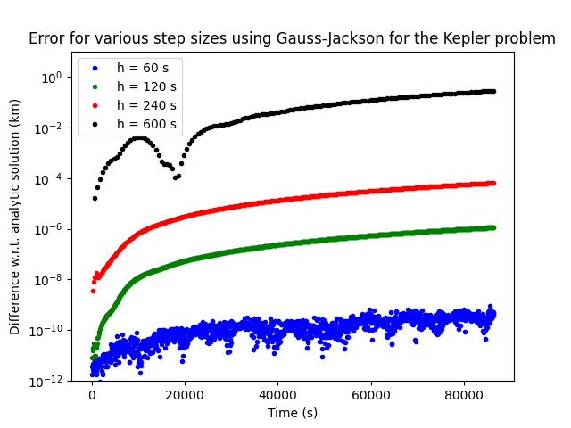

# GaussJackson
A C++ implementation to integrate equations of the form y''=f(y,y',t) using the eighth order Gauss-Jackson method. Historically used in the astrodynamics comuninity from the 1960s onward. The Gauss-Jackson method is a multi-step predictor-corrector method where the previous points are used to approximate the next state which is then iterated upon until below some tolerance. To initiate the process, a different numerical intergrator is used to start the process. This implementation is based on the outline and constants given in: Berry and Healy, Implementation of Gauss-Jackson Integration for Orbit Propagation, J. Astronaut. Sci. 52, 331-357, 2004.https://drum.lib.umd.edu/handle/1903/2202

## Requirements
Requires [Odeint](http://headmyshoulder.github.io/odeint-v2/) libraries for initial start-up procedure and [Boost](http://boost.org).

## Use
Algorithm is called by GJ8::propagate(Initial_State,ode,t0, tf, h, outputBool, outputTime) where Initial_state is a Boost array, ode is the name of the function to be integrated in the same for as handled by Odeint e.g. void ode(const boost::array<double, 1> &x, boost::array<double,1> &dxdt, double t), t0 is the initial time, tf is the time to be integrated to, h is the step-size interval, outputBool is a Boolean flag which will produce an output file for all steps between [t0,tf] and outputTime is the step in output if not all steps are not required

## Example
The Gauss-Jackon method is often used for astrodynamics problems. An example is included which shows this method being used to solve the Kepler problem for various different step-sizes over the course of 24 hours. We then compute the error of each step-size compared to the analytic solution.

